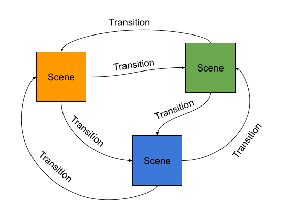

<span class="bigasstitle">MeanStream Docs</span>

# Introduction

MeanStream was born out of the need to create complex, yet reliable macros for Blackmagic Design ATEM switchers. While tools exist that communicate with ATEM switchers over the network to manipulate switcher settings, MeanStream chooses the built-in macro functionality as a foundation to managing different ATEM settings that provides the necessary stability and performance to run animations smoothly. ATEM switchers allow the creation of macros by either recording configuration changes the user makes via the provided software or by writing and importing macros in XML format. MeanStream’s purpose is to produce macros in the XML format which can then be imported into ATEM devices.

# What Do I Need?

**Mandatory: Blackmagic Design ATEM:**

There is only one thing, you really really need and that's a supported Blackmagic Design ATEM switcher. MeanStream mainly generates macros for ATEM switchers that can be triggered in mulitple ways including Blackmagic Design's ATEM Software Control application.

Supported ATEM switchers include:

- ATEM Mini
- ATEM Mini Pro
- ATEM Mini Pro ISO
- ATEM Mini Extreme 
- ATEM Mini Extreme ISO
- ATEM 1 M/E Constellation HD
- ATEM 2 M/E Constellation HD
- ATEM 4 M/E Constellation HD
- ATEM 2 M/E Production Studio 4K
- ATEM Constellation 8K in 4K mode

**Optional: Bitfocus Companion** 

In addition to ATEM macros, MeanStream generates configuration for Bitfocus Companion which can be used to project buttons and pages of buttons onto, for example, an Elgato Stream Deck.

**Optional: Elgato Streamdeck** 

MeanStream works with the 15 button and the 32 button Stream Deck. 


# Quick Start

1. Go to https://meanstream.io and create an account. An account is necessary to keep 
your configuration apart from that of other users so MeanStream can protect your configs from manipulation by other users.
2. Create and configure a Project. Projects allow you to manage different sets of Scenes. Each project represents an event, live stream or recording that you are planning or have already performed.
3. Set up the Scenes you need for your event. If you know ATEM Software Control well, you should find your way around very quickly.
4. Export the Project as a ZIP file. This archive includes all files necessary to import the config into your ATEM and Bitfocus Companion.

# Basic Concepts

MeanStream uses Projects, Scenes and Transitions to produce the macros you need.

Projects allow you to manage different sets of Scenes. Each project represents an event, live stream or recording that you are planning or have already performed. While configuration changes are possible, each Project is designed to run on a specific ATEM model which should be configured upfront.

A Scene represents a specific configuration the ATEM devices should be in. Scenes can be as simple as “show camera 1 fullscreen" but may include advanced configurations such as multiple boxes, overlays and other effects.

Transitions describe the process of getting from one Scene to another. ATEM devices support several built-in transitions such as “Mix", “Dip" or “Wipe" among others. MeanStream allows you to utilize all of the built-in functionality and adds additional capabilities where possible. Transitions may include animations of various properties (position, size, etc) of video sources for more professionally looking results. MeanStream generates default but configurable Transitions for every combination of Scenes.




# Projects

Projects allow you to manage different sets of Scenes and Transitions. Typically, you would 
create a new Project for each new event, stream or other activity that requires an adjusted
ATEM configuration.

## Creating A New Project

A new Project with a defaul tname is created via the navigation menu on the left. 


The Project's name can then be changed in the Project settings.

## Project Settings

One of the first things, you want to do after creating a new Project is
to configure it.


There are many options to be configured which is why the Project settings page is divided into multiple sections:

### General

**Project Name:** The name of the Project can be changed at any time. Doing so has no implications whatsoever.

### ATEM Settings

To work optimally, MeanStream needs to know about your ATEM device.

**Model:** The ATEM model let's MeanStream display the right inputs and features when it comes to editing Scenes and Transitions. This ensures your configuration is actually compatible with the ATEM it gets loaded into.

**Switcher Name:** In case you have more than only one ATEM switcher, you will probably have some way to identify it. Type in that identifer, it will come in handy sooner or later.

**Video Mode:** MeanStream allows you to configure Transition durations in milliseconds. Setting this correctly, will allow MeanStream to produce macros accordingly.

**Input Source:** Every ATEM has a lot of input sources. Especially on larger devices it becomes impossible to memorize which input device (camera, computer, Hyperdeck, etc) is connected to which HDMI or SDI input. By giving them names, you will be able to easily identify the right input source when configuring Scenes or Transitions.

**Hyperdecks:** ATEMs can connect to up to 4 Blackmagic Design Hyperdeck devices which can be controlled via macros, too. Telling MeanStream which connections are in use and by giving the Hyperdeck a speaking name, you can easily identify the right device later down the road.


### Defaults & Templates

**Transition Template:** MeanStream generates a Macro for every Transition and one Transition for every pair of Scenes. This way to can navigate from every Scene to every other Scene in a reproducable manner. With 10 Scenes, this leads to 90 Transitions which need to be configured. By setting a Transition template, you can configure 90 Transitions with a single click and overwrite the defaults for specific Scenes.


### Export Tweaks

**Macro Range:** MeanStream produces an XML file to be imported into your ATEM switcher. The XML file contains the macro pool representing the transitions. ATEMs support a limited number of macros (99). By setting the range of macro slots to be used by MeanStream, you can protect your own macros from getting overwritten by MeanStream. No macro will be outside the range and MeanStream will fill the range from the end starting at 99.

**Macro Wipe:** Importing macros into an ATEM will overwrite macros that use the same slot (index) but will NOT delete any macros not specified in the XML. Previously created macros will not get cleaned up properly. By enabling macro wipe, MeanStream will fill the macro range with empty macros and give them a speaking name. This is a workaround for ATEM's lack of ability to delete macros via XML import.


## Deleting A Project

A Project can be deleted from the Project settings page. Scrolling all the way down you will find a section called **Nope Zone**. Hit "Delete" and confirm the deletion. **Warning:** All Scenes and Transitions in this Project will be lost.


# Scenes

## Creating Scenes

In the Project menu, click "Scenes" to see a list of Scenes available to that Project. Each 
Scene is represented by a card which includes the name of the Scene, the main input source, a preview of the Scene and some buttons and controls.


By clicking the "Create Scene" button at the top, a new Scene is created with a default name and appended to the end of the list.

## Rearranging Scenes

The order in which the Scene appear is important. It will influence the order in which ATEM
macros will be positioned in the macro pool. More importantly, this will also define the
order in which buttons will appear on your Streamdeck.

To change the order of Scene, toggle the "Rearrange" option at the top and use the arrow controls to move Scenes left or right. Changes will be saved immediately.


## Scene Configuration

Navigating into a Scene, the menu on the left will change it's context to that Scene and gives you access to various properties, configs and settings.

### Settings

**Name:** The name of the Scenes. Changing this will change the name of macros that transition to or from this Scene as well as Companion button configurations.

**Enable:** By disabling a Scene, it will be excluded from ATEM macro and companion button
generation. This feature can by used to treat a Scene as a template.


### Video

The "Video" button of the Scene menu, takes you to the Scene editor. Mostly, the video editor's layout is very close to what the corresponding configuration looks like in ATEM
Sofware control. Therefore, we will cover only some important aspects in this guide.


**Input Source:**
In the top left corner, an input source must be selected. MeanStream
uses a drop down menu for the selection instead of a button per input source as shown in ATEM Software control.


**Checkboxes:**
Super Sources, Hyperdecks, MediaPlayers, Upstream Keys, Downstream Keys and Color Generators have little checkboxes used to enable/disable the configuration. Disabling an element, will make sure the element is NOT visible in the Scene and any
properties of the element will be left untouched.

**Visibility:**
Some elements, e.g. Super Source boxes, have an additional property to indicate visibility. To make such an elemement visible it must be enablend AND set to visible. This is useful to animate visibility in keyframe animations.

**On Air Indicators:**

MeanStream helps you quickly identify which parts of the Scene editor are currently
relevant for the Scene by placing indicators at each element. The indicators show whether
an element is **on air** (red) and **configured** (U).


**Drag & Drop:**

The preview window as support for drag & drop based editing of positions, sizes and cropping for most of the available elements. Since input sources can be layered (USK, DKS)
you can use the "Hide USKs" and "Hide DSK" controls to temporarily hide those layers if your want to edit elements in the background.


### Audio

Audio controls are currently being reworked. The feature is disabled at the moment.

## Cloning Scenes

Scenes can be cloned within the Project. This will create an exact copy of that Scene in 
the Project including the name (!). The name MUST be changed in order to avoid conflicing 
macro or Companion button names.


## Deleting Scenes

A Scene can be deleted from the Scene card context menu or its settings page. After confirming the deletion, the Scene will be irrevocably wiped off the face of this earth.


# Transitions

## Creating & Deleting Transitions

As described in a previous section, every Project defines a Transition template that applied to each pair of Scenes that is not explicitly configured. 

The "Transitions" section in the Project menu, takes you to what's called the "Transition Matrix". You will see a tabular representation of each combination of Scenes (rows and columns). The respective cell represents the currently active Transition.

Default Transitions generated from the Project's Transition template will be shown in light grey along with the text "(Default)". Any Transition shown in solid black color is explicitly configured.


To overwrite the Project default, simply click the cell with the default Transition. This will create an explicit Transition with the same configuration as the default Transition and take you to the Transition editor for editing. The editor allows you to change the Transition type along with all its properties.

To delete an explicit Transition, go to the Transition editor and hit "Delete". After confirming the deletion, you will be taken back to the Transition Matrix. The Transition for this pair of Scenes will fallback to the Project's default.

## Native Transitions

MeanStream supports all ATEM native Transitions including Cut, Mix, Dip, Wipe, DVE and Stinger (Media Player Stinger) if supported by the ATEM model.


If you know ATEM Software Control and the ATEM's Transition types, you should find your way around easily. All native Transition types can be edited via the user interface. If you want to use the code editor, refer to the [API Schema](#api-schema) section for details on the structure, properties and their values.

## MeanStream Transitions

MeanStream extends the ATEM's capabilities by providing additional Transition types implemented
via ATEM macros:


### Hyperdeck Stinger Transition

ATEM's support connecting Hyperdeck devices which can be used as video players that feed into the ATEM. If configured in the Project settings, the Hyperdeck Stinger Transition will appear in the Transition editor.

This Transition works roughly like this:

1. Set up the target Scene configuration in the ATEM's preview
2. Configure and activate a Downstream Key in the program that overlays the Hyperdeck's input
3. Play the clip on the Hyperdeck
4. Cut preview to program at the right time.


**Hyperdeck Selection:**

Choose the Hyperdeck you want to use. It MUST be configured in the Project settings.

**Hyperdeck Settings:**

Configure the clip to play.

**Clip Information:**

Provide information about the clip.


**Downstream Key Settings:**

MeanStream does not know the HDMI/SDI input the Hyperdeck is connected to. Make sure to configure this correctly in the Downstream Key settings:


### Animated Transition

Unlike other Transition types, the Animated Transition is NOT based on the classic preview/program workflow but manipulates the ATEM settings live. MeanStream animations are **based on keyframes** which gives you great power of the animation flow.

Any Transition consists of a "source" and a "target" Scene which represent the first and the last keyframe of the Animation. This is enough to generate an animation but you may specify additional keyframes for more complex animations. MeanStream allows animating ANY propery of the Scene configuration including colors, premultiplied key settings and everything else.

Animated Transitions are a complex thing to configure and a user interface has not been developed, yet. As an alternative, you may use the code editor to textually configure the animation in YAML format.


Check the [API Schema](#api-schema) section for details on the structure, properties and their values.

**Merging**

As mentioned before, a Transition's source and destination Scenes represent the first and the last keyframe of the animation. Translating that to timestamps: The source scene is at 0.0, the target Scene at 1.0. What if you define a keyframe with one of those timestamps?

1. The keyframe with timestamp 0.0 will be merged into the source Scene and be deleted.
2. The keyframe with timestamp 1.0 will be merged into the target Scene and be deleted.


### Composite Transition

There are situations in which other Animation Transition reach their limits or it is very hard to implement a specific behavior using only a single Animated Transition. For such situation,s Composite Transitions allow you to chain other Transitions and "execute" them in sequence.

To model Transitions in a CompositeTransition the object type of `EmbeddedTransition` is used. There is no source scene required in an EmbeddedTransition as the source scene config is defined by the previous embedded transition or the Composite Transition's source Scene in case of the first embedded Transition.

The target Scene of the last embedded Transition can be left unspecified. In that case, the Composite Transition's target Scene will be used.

Check the [API Schema](#api-schema) section for details on the structure, properties and their values.

**Example:**
```yaml
transitions:
  - to:
      source: Camera3
      upstreamKeys:
        - type: PatternKey
          index: 0
          ...
    config:
      type: Cut
  - config:
      rate: 3000
      keyframes:
        - timestamp: 0.5
          config:
            upstreamKeys:
              - type: PatternKey
                index: 0
                ...
      configs:
        properties:
          /upstreamKeys/0/*:
            interpolation: LINEAR
            easing: CUBIC_EASE_IN_OUT
      type: Animated
type: Composite
```

# Bundles

Every Project allows you to view and download generated configuration as a ZIP file. The export function can be found in the Project's menu on the left and is called "Bundle".


This opens the the Bundle page which displays an embedded text editor and a file browser on the right hand side.


To download the ZIP file click the "Download ZIP" button at the top of the page.

## ATEM Configuration

The "atem.xml" file contains XML formatted data that you may import into your ATEM device. For compatibility with your device it mentions your ATEM model name line 0 as the “product" attribute. The important bit is the macro pool and the macro sections within. Each macro then contains a set of operations (“Op"). The operations of a macro manage the transition from one Scene to another. In the screenshot below, the macro with index 99 (last macro in the pool) is meant to transition from the Scene “SPEAKER" to “WHITEBO". These are the "name" properties (not display name!) of the respective Scenes.

To import the macros into your ATEM proceed as follows:

1. Open ATEM Software Control
2. Go File -> Restore
3. Select the "atem.xml" file and hit "Restore"
4. In the Restore window, make sure the “Macros" option is selected and hit "Restore"

After the import process has finished successfully, macros can be viewed and executed from within ATEM Software Control or via Bitfocus Companion (see next section). In ATEM Software Control macros can be found via the Macros -> Macros menu and triggered from the "Run" section.

Keep in mind that MeanStream fills the macro pool from the end, so you need to navigate to the last page in the “Macros" window to find the first macro.

## Bitfocus Companion

With a total of `n*(n-1)` (n = the number of Scenes) macros in the macro pool it is almost impossible to find the right macro for the next Transition in a reasonable amount of time. MeanStream generates a configuration file for Bitfocus Companion which can be used in conjunction with an Elgato Stream Deck to trigger the right macros at the right time.


For each Scene, MeanStream generates a Companion page such as illustrated in the screenshot above. Each page contains buttons that trigger only those macros to transition from exactly that Scene to any other Scene. So with n Scenes, there will be n-1 buttons on any page that trigger macros. When such a button is pressed, the respective macro is triggered and Companion will navigate to the page of the destination Scene. This way, the user will always see the right buttons that trigger the right macros without having to worry about finding the right macro manually.

In addition to the macro buttons, each pages contains two navigation buttons (page up, page down) to manually navigate the pages. Another button is used to indicate the current Scene.

### Supported Devices

The navigation and Scene indicator buttons mentioned above are generated to be stacked on top of each other in the leftmost column of the Stream Deck. This means the Stream Deck in use must have at least three rows of buttons.

With a maximum of 10 Scenes due to limitations of the ATEM macro pool, a button page can have a maximum of 9 macro buttons. This plus the mandatory 3 buttons for navigation and the Scene label, result in a maximum of 13 buttons to be used by MeanStream. Therefore, the best fit for MeanStream are the 15 button models of the Elgato Stream Deck. Larger models can be used but there will always be a significant amount of empty and unused hardware buttons.

| Model | Buttons | Rows | Supported | Wasted Buttons |
|---|---|---|---|---|
| Stream Deck Mini | 6 | 2 | no | n/a |
| Stream Deck + | 8 | 2 | no | n/a |
| Stream Deck MK.2 | 18 | 3 | yes | > 2 |
| StreamDeck XL | 32 | 4 | yes | > 19 |

### Importing Pages & Buttons

To import MeanStream’s Companion buttons proceed as follows:

1. Open your Bitfocus Companion administration page
2. Navigate to the “Buttons” tab
3. On the right side of the screen, navigate to the “Import / Export” tab
4. Click the “Import” button


# API Schema

## `TransitionConfig`

| Property | Description | Values |
|---|---|---|
| type | The type of the transition. Refer to respective section below for more properties. | `Cut`, `Dip`, `Wipe`, `DVE`, `MediaPlayerStinger`, `HyperdeckStinger`, `Animated`, `Composite` |

### `CutTransitionConfig`

No further properties.

### `DipTransitionConfig`

| Property | Description | Values |
|---|---|---|
| rate | The time in milliseconds for the transition to take. | Integer, > 0 |
| dipSource | The source to dip to. | [Source](#Source) |
| color | If `dipSource` is a color generator, the configuration of that object. | [ColorGenerator](#ColorGenerator) |
| mediaPlayer | If `dipSource` is MediaPlayer or MediaPlayerKey, the configuration of that object. | [MediaPlayer](#MediaPlayer) |

### `WipeTransitionConfig`

| Property | Description | Values |
|---|---|---|
| rate | The time in milliseconds for the transition to take. | Integer, > 0 |
| mode | The wipe mode to configure | LeftToRightBar, TopToBottomBar, HorizontalBarnDoor, VerticalBarnDoor, CornersInFourBox, RectangleIris, DiamondIris, CircleIris, TopLeftBox, TopRightBox, BottomRightBox, BottomLeftBox, TopCentreBox, RightCentreBox, BottomCentreBox, LeftCentreBox, TopLeftDiagonal, TopRightDiagonal |
| symmetry | The symmetry of the `mode` if applicable | Double, 0 <= x <= 1 |
| position | The position of the `mode` if applicable | [Position](#Position) |
| reverse | Reverse the direction of the transition | Boolean |
| flipFlop | Switch between directions when transitioning multiple times | Boolean |
| borderSoftness | The softness of the border | Double, 0 <= x <= 1 |
| borderWidth | The width of th eborder | Double, 0 <= x <= 1 |
| borderFillInput | The input source to use for the border | [Source](#Source) |

### `DveTransitionConfig`

| Property | Description | Values |
|---|---|---|
| rate | The time in milliseconds for the transition to take. | Integer, > 0 |
| pattern | The DVE pattern to configure | PushTopLeft, PushTop, PushTopRight, PushLeft, PushRight, PushBottomLeft, PushBottom, PushBottomRight, SqueezeTopLeft, SqueezeTop, SqueezeTopRight, SqueezeLeft, SqueezeRight, SqueezeBottomLeft, SqueezeBottom, SqueezeBottomRight, GraphicLogoWipe |
| reverse | Reverse the direction of the transition | Boolean |
| flipFlop | Switch between directions when transitioning multiple times | Boolean |
| premultipliedKey | Use premuliplied key or configure manually | [PremultipliedKey](#premultipliedkey) |
| fillInput | The fill input | [Source](#Source) |
| cutInputEnable | Enable or disable the key input | Boolean |
| cutInput | The key input | [Source](#Source) |

### `MediaPlayerStingerTransitionConfig`

| Property | Description | Values |
|---|---|---|
| clipDurationMillis | The duratio of the clip | Integer, > 0 |
| triggerPointMillis | The point at which to cut to the new scene | Integer, > 0 |
| mixRateMillis |  | Integer, > 0 |
| preRollMillis | The time to run the clip before displaying it | Integer, > 0 |
| mediaPlayer | The media player settings for the transition | [MediaPlayer](#MediaPlayer) |

### `HyperdeckStingerTransitionConfig`

| Property | Description | Values |
|---|---|---|
| clipDurationMillis | The duratio of the clip | Integer, > 0 |
| triggerPointMillis | The point at which to cut to the new scene | Integer, >= 0 |
| mixRateMillis | | Integer, >= 0 |
| preRollMillis | The time to run the clip before displaying it | Integer, >= 0 |
| downstreamKey | The DSK and DSK settings to apply to render the clip | [DownstreamKey](#downstreamkey) |
| hyperdeck | The Hyperdeck config to play the clip  | [Hyperdeck](#hyperdeck) |

### `AnimatedTransitionConfig`

| Property | Description | Values |
|---|---|---|
| rate | The time in milliseconds for the transition to take. | Integer, > 0 |
| keyframes | A list of keyframes between the Transition's source and target SceneConfig | [KeyFrame](#keyframe)[] |
| configs.properties | Maps a [Selector](#selector) to an [AnimationConfig](#animationconfig) object | Map<String, AnimationConfig> |

#### Selector

The selector is used to identify one or multiple properties in a [SceneConfig](#sceneconfig) object. It is in string format and separates subselectors by a `/` (slash) character similar to files and paths on a storage device. Selectors support wildcards (`*`) to match any property. When indexing into lists, a number is used that matches the `index` property of the object in the list.

Examples:

| Selector | Description |
|---|---|
| `/superSources/0` | The first SuperSource |
| `/superSources/*` | All SuperSources |
| `/superSources/0/boxes/0` | The first Box in the first SuperSource |
| `/superSources/*/boxes/*` | All Boxes in all SuperSources |

Note that the above examples do not match a property, yet. Boxes have properties that can be animated, so actual working examples would be the following:

| Selector | Description |
|---|---|
| `/superSources/*/boxes/*/position` | The Position of all Boxes |
| `/superSources/*/boxes/*/size` | The size of all Boxes |

The following is a list of all currently supported Selectors using wildcards for all lists in the path:

- `/superSources/*/boxes/*/visible`
- `/superSources/*/boxes/*/source`
- `/superSources/*/boxes/*/position`
- `/superSources/*/boxes/*/size`
- `/superSources/*/boxes/*/crop`
- `/colors/*/`
- `/upstreamKeys/*/scale` (Pattern, Luma)
- `/upstreamKeys/*/position`  (Pattern, Luma)
- `/upstreamKeys/*/crop` (Pattern, Luma)
- `/upstreamKeys/*/patternPosition` (Pattern)
- `/upstreamKeys/*/size` (Pattern)
- `/upstreamKeys/*/symmetry` (Pattern)
- `/upstreamKeys/*/softness` (Pattern)

#### `KeyFrame`

| Property | Description | Values |
|---|---|---|
| timestamp | The time within the duration of the animation | Double, 0 <= x <= 1 |
| config | The configuration that is effective at that time | [SceneConfig](#sceneconfig) |

**Timestamp:** The timestamp is a percentage relative to the duration (rate) or the Transition. `0` and `1` represent the first and last keyframes and trigger [merging](#merging) (!)

#### `AnimationConfig`

| Property | Description | Values |
|---|---|---|
| interpolation | The interpolation method to use. | NONE, LINEAR, CUBIC |
| easing | The method used to accelerator or decelerate the animation. | NONE, CUBIC_EASE_IN, CUBIC_EASE_OUT, CUBIC_EASE_IN_OUT, QUADRATIC_EASE_IN, QUADRATIC_EASE_OUT, QUADRATIC_EASE_IN_OUT |

**Interpolation:** Interpolation describes the method to calculate values between 2 KeyFrames. `NONE` will retain the current value until the next KeyFrame defines a new value. `LINEAR` will gradually approach the value of the next KeyFrame. The value `CUBIC` has an effect only on `Position` properties and generates a curved line through all defined coordinates.

**Easing:** Easing defines acceleration or decelleration in the change of the value over time. `NONE` will result in same-speed animation across the entire animation. `CUBIC*` and `QUADRATIC*` stand for different levels of "aggressiveness" in the acceleration or decelleration. `IN` and `OUT` represent acceleration and deceleration respectively. So, if you want slight acceleration and and abrupt stop you would choose `CUBIC_EASE_IN`.

### `CompositeTransitionConfig`

| Property | Description | Values |
|---|---|---|
| transitions | A list of transitions that will be executed in order | [EmbeddedTransition](#embeddedtransition)[] | 

#### `EmbeddedTransition`

| Property | Description | Values |
|---|---|---|
| to | The target configuration to transition to. | [SceneConfig](#sceneconfig) |
| config | The type and configuration of the Transition | [TransitionConfig](#transitionconfig) |

## `SceneConfig`

| Property | Description | Values |
|---|---|---|
| source | The input source to display in the program output | [Source](#Source) |
| superSources | A list of SuperSources | [SuperSource](#supersource)[] |
| upstreamKeys | A list of Upstream Keys  | [UpstreamKey](#upstreamkey)[] |
| downstreamKeys | A list of Downstream Keys | [DownstreamKey](#downstreamkey)[] |
| hyperdecks | A list of Hyperdecks | [Hyperdeck](#hyperdeck)[] |
| mediaPlayers | A list of Media Players | [MediaPlayer](#MediaPlayer)[] |
| colorGenerators | A list of Color Generators | [ColorGenerator](#ColorGenerator)[] |

### `SuperSource`

| Property | Description | Values |
|---|---|---|
| index | The index of the SuperSource (0 = first one) | Integer, > 0 |
| enabled | Whether actually configure it or leave unchanged  | Boolean |
| boxes | A list of Boxes | [Box](#box)[] |
| art | The art config to apply | [Art](#art) |

#### `Box`

| Property | Description | Values |
|---|---|---|
| index | The index of the Box (0 = first one) | Integer, > 0 |
| enabled | Whether actually configure it or leave unchanged | Boolean |
| visible | Whether to make the Box visible | Boolean |
| source | The input source to render in the Box | [Source](#source) |
| position | The Position of the Box | [Position](#position) |
| size | The art config to apply | Double, 0 <= x <= 1 |
| crop | The cropping to apply | [Crop](#crop) |

#### `Art`

| Property | Description | Values |
|---|---|---|
| mode | The art mode | BACKGROUND, FOREGROUND |
| fillSource | The fill source to use | [Source](#source) |
| keySource | The key source to use | [Source](#source) |
| premultipliedKey | Use premuliplied key or configure manually | [PremultipliedKey](#premultipliedkey) |

### `UpstreamKey`

The following properties apply to all Upstream Key types:

| Property | Description | Values |
|---|---|---|
| type | The type of USK | LumaKey, ChromaKey, PatternKey, DveKey |
| index | The index of the Box (0 = first one) | Integer, > 0 |
| onAir | Wheter to make the Upstream Key visible | Boolean |
| fillInput | The input to use as fill | [Source](#source) |
| scale | The scaling to apply | [Scale](#scale) |
| position | The Position of the USK | [Position](#position) |

#### `LumaKey`

| Property | Description | Values |
|---|---|---|
| keyInput |  | |
| mask | |  |
| premultipliedKey |  |  |

#### `ChromaKey`

| Property | Description | Values |
|---|---|---|
| chromaSample |  | [Cursor](#cursor) |
| mask | | [Mask](#mask) |
| keyAdjustments |  | [KeyAdjustments](#keyadjustments) |
| chromaCorrections |  | [ChromaCorrections](#chromacorrections) |
| colorAdjustments |  | [ColorAdjustments](#coloradjustments) |

##### `Cursor`

| Property | Description | Values |
|---|---|---|
| enabled |  | Boolean |
| size | | Double, 0 <= x <= 1 |
| position |  | [Position](#position) |

##### `KeyAdjustments`

| Property | Description | Values |
|---|---|---|
| foregroundLevel |  | Double, 0 <= x <= 1 |
| backgroundLevel | | Double, 0 <= x <= 1 |
| keyEdge |  | Double, 0 <= x <= 1 |

##### `ChromaCorrections`

| Property | Description | Values |
|---|---|---|
| spillSuppress |  | Double, 0 <= x <= 1 |
| flareSuppress |  | Double, 0 <= x <= 1 |


##### `ColorAdjustments`

| Property | Description | Values |
|---|---|---|
| brightness |  | Double, -1 <= x <= 1 |
| contrast |  | Double, -1 <= x <= 1 |
| saturation |  | Double, 0 <= x <= 2 |
| red |  | Double, -1 <= x <= 1 |
| green |  | Double, -1 <= x <= 1 |
| blue |  | Double, -1 <= x <= 1 |


#### `DveKey`

| Property | Description | Values |
|---|---|---|
| mask | The mask to apply | [Mask](#mask) |
| shadow | The shadow to show | [Shadow](#shadow) |
| border | The border to configure | [Border](#border) |

##### `Shadow`

| Property | Description | Values |
|---|---|---|
| enabled | Whether actually configure it or leave unchanged | Boolean |
| angle |  | Integer, 0 <= x <= 350 |
| altitude |  | Integer, 10 <= x <= 100 |

##### `Border`

| Property | Description | Values |
|---|---|---|
| enabled | Whether actually configure it or leave unchanged | Boolean |
| color |  | [HueColor](#huecolor) |
| outerWidth |  | Double, 0 <= x <= 16 |
| innerWidth |  | Double, 0 <= x <= 16 |
| outerSoften |  | Double, 0 <= x <= 1 |
| innerSoften |  | Double, 0 <= x <= 1 |
| borderOpacity |  | Double, 0 <= x <= 1 |

#### `PatternKey`

| Property | Description | Values |
|---|---|---|
| pattern | | PushTopLeft, PushTop, PushTopRight, PushLeft, PushRight, PushBottomLeft, PushBottom, PushBottomRight, SqueezeTopLeft, SqueezeTop, SqueezeTopRight, SqueezeLeft, SqueezeRight, SqueezeBottomLeft, SqueezeBottom, SqueezeBottomRight, GraphicLogoWipe |
| invertPattern |  | Boolean |
| size |  | Double |
| symmetry |  | Double |
| softness |  | Double |
| mask |  | [Mask](#mask) |
| patternPosition |  | [Position](#position) |

## Common

### `Position`

| Property | Description | Values |
|---|---|---|
| x | The x coordinate | Double |
| y | The y coordinate | Double |

### `ColorGenerator`

| Property | Description | Values |
|---|---|---|
| index | The index of the ColorGenerator (0 = the first color) | Integer, > 0 |
| enabled | Whether actually configure it or leave unchanged | Boolean |
| color | The color to configure. | [HueColor](#huecolor) |

### `HueColor`

| Property | Description | Values |
|---|---|---|
| hue | The hue value | Double, 0 <= x <= 359|
| sat | The saturation | Double, 0 <= x <= 1 |
| lum | The luminiscence | Double,, 0 <= x <= 1 |

### `MediaPlayer`

| Property | Description | Values |
|---|---|---|
| index | The index of the Media Player (0 = the first one) | Integer, >= 0|
| enabled | Whether actually configure it or leave unchanged | Boolean |
| stillIndex | The index of the still to load | Integer, >= 0|
| clipIndex | The index of the clip to load | Integer, >= 0 |

### `DownstreamKey`

| Property | Description | Values |
|---|---|---|
| index | The index of the Downstream Key (0 = the first one)  | Integer, >= 0|
| fillSource | The fill source to use | [Source](#Source) |
| keySource | The key source to use | [Source](#Source) |
| mask | The mask to apply | [Mask](#mask) |
| premultipliedKey | Use premuliplied key or configure manually | [PremultipliedKey](#premultipliedkey) |
| onAir | Whether to make this DSK visible | Boolean |

### `Mask`

| Property | Description | Values |
|---|---|---|
| enabled | Whether actually configure it or leave unchanged | Boolean |
| top | The amount of masking to apply | Double, -9 <= x <= 9 |
| right | The amount of masking to apply | Double, -16 <= x <= 16 |
| bottom | The amount of masking to apply | Double, -9 <= x <= 9 |
| left | The amount of masking to apply | Double, -16 <= x <= 16 |

### `PremultipliedKey`

| Property | Description | Values |
|---|---|---|
| enabled | Whether actually configure it or leave unchanged | Boolean |
| clip | The clip value | Double, 0 <= x <= 1 |
| gain | The gain value | Double, 0 <= x <= 1 |
| invert | Whether to invert the key | Boolean |

### `Hyperdeck`

| Property | Description | Values |
|---|---|---|
| index | The index of the Hyperdeck (0 = the first one) | Integer, >= 0 |
| enabled | Whether actually configure it or leave unchanged | Boolean |
| mode | The playback mode | PLAY_ONCE, PLAY_AND_LOOP, PLAY_AND_CONTINUE, STOP |
| clipIndex | The index of the clip to play | Integer, >= 0 |
| speedPercent | The playback speed | Double, 0 <= x <= 1 |

### Source

ATEM uses strings to represent different input sources. The following list of input sources comes from an ATEM Mini Extreme but shows quite well the format and pattern:

`Black`, `Camera1`, `Camera2`, `Camera3`, `Camera4`, `Camera5`, `Camera6`, `Camera7`, `Camera8`, `ColorBars`, `Color1`, `Color2`, `SuperSource`, `MediaPlayer1`, `MediaPlayer2`, `MediaPlayer1Key`, `MediaPlayer2Key`

### Crop

| Property | Description | Values |
|---|---|---|
| enabled | Whether actually configure it or leave unchanged | Boolean |
| top | The amount of masking to apply | Double |
| right | The amount of masking to apply | Double |
| bottom | The amount of masking to apply | Double |
| left | The amount of masking to apply | Double |

### Scale

| Property | Description | Values |
|---|---|---|
| x | The scale factor on the x axis | Double, >= 0 |
| y | The scale factor on the y axis | Double, >= 0 |